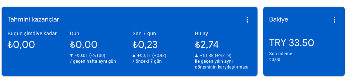

Davetiyem.co yani dijital düğün davetiye oluşturma projesini 19 Ocak 2019 tarihinde yayına almıştım. Yaklaşık 2 yıldır yayında olan projemi 27 Eylül 2020 itibari ile sonlandırmış bulunmaktayım. Tamamen deneyim kazanmak ve bir şeyler başarabilmek için çıktığım bu yolda güzel deneyimler ve birikimler kazandım. Burada ise kendime bir kaç şeyler demek ve bu süreç içerisinde neler öğrendiğimi, neleri yanlış yaptığımı sizlerle de paylaşmak istedim.

## Teksen hiçbir şeysin!

Tamam, çok güzel. Bir fikrin var ve inanıyorsun ki ben bunu başaracağım. Kendine inanıyorsun ve pozitifsin, çok güzel. Peki yanında kim var? Projeyi geliştirirken kimlerle çalışacaksın? Çalışma arkadaşların kim?

Ben en büyük sorunlarımdan biri projede yalnız olmamdı. Bundan dolayı ki her şeye benim koşmam ve halletmem gerekiyordu. Bu şekilde tamamen kendimi yordum ve verimli bir şekilde proje üzerinde düşünemedim. Odağını sadece bir yönde toplamak o işe olan verimliliğini arttıracaktır. Sadece 3 kişi olduğunuzu düşünsene. Sen yazılım tarafında bakıyorsun, bir arkadaşın tasarım kısmına, diğer arkadaşın ise pazarlama. Bence 3 kişi ile güzel bir çalışma bile çıkarılır. Yeter ki görev dağılımı yapın ve herkes gönülden çalışsın.

## Bir an önce pazara çıkın!

Zamanında şöyle bir tweet atmıştım.

<blockquote class="twitter-tweet">
Aslında kod yazmanın hiçbir şey olmadığını, asıl kısım algoritmayı kurmak ve pazarlamak. Peki neden hala kodlama kısmı için çok fazla zaman harcıyoruz? Bir an önce canlıya çıkmaya odaklanmalıyız.
&mdash; Berat Bozkurt (@beratbozkurt0) <a href="https://twitter.com/beratbozkurt0/status/1290376689667776512?ref_src=twsrc%5Etfw">August 3, 2020</a></blockquote>

Gerçekten de öyle. Çünkü bir şekilde o projeyi uygulama haline getirebilirsin. Neden hala kodlama üzerine kafa yoruyoruz ki? Zaten hiçbir şey düşündüğünüz gibi olmuyor ve yayına aldıktan sonra bir çok şeyi değiştiriyorsunuz. Fikrinizi en basit şekilde (MVP) uygulama haline getirin ve yayına alın. Zaten yayındayken de bir şeyler ekleyip bir şeyler de kaldıracaksın. Kodlama ile neden bu kadar çok vakit kaybediyoruz?

İsterseniz fikri kodlamak için 5–6 ay harcayın. Başarı garanti mi? Projeyi bir an önce yayına alıp pazarlama ve kullanıcıyı uygulamada tutmak — kullanıcı kazanmak demiyorum, dikkat edin — için çalışmalar yapın.

## Pazarlamaya ağırlık verin!

Projede tasarımı yapan, yazılım tarafıyla ilgilenen, sosyal medya ve blog sayfaların yöneten bendim. Ama gelgelelim pazarlama dünyası. Diğerlerini bir şekilde yapabiliyorsun ama pazarlama çok ayrı bir dünya. Ben kendi çevremde paylaşabildiğim kadarıyla paylaşıyordum ama bu yeterli değildi. Pazarlama kısmına ağırlık verip kullanıcılara ulaşır ve güzel bir stratejiyle de kullanıcıyı uygulamada tutarsınız.

## Bütçesiz çok zor!

Bütçesiz bir seviyeye kadar oluyor, olamam demem ama. Bu seviye girişimi kurduktan ilk 1 ay falan. Bir aydan sonra belli bir takım harcamalar yapılması gerekiyor. Yoksa uygulama olduğu yerde kalır ve sizin tek yaptığınız bugün uygulamayı kaç kişi kullanmış, kaç kişi üye olmuş.

Bu süreçten çıkardığım konular genel itibariyle bu şekilde. Birazda bana kazandırdıklarından konuşmaya ne dersiniz?

Projeden maddi olarak kazandığım rakam bu şekilde. Sadece blog sayfasında adsense kullanıyordum ve son zamanlarda günde bir kaç tık alıyorduk. Toplanan miktar bu şekilde :)

Projeyi son 1–2 aydır ücretli versiyona geçtim ama ne gelen oldu ne de giden :) O yüzden üyeliklerden bir kazancım olmadı. Kazancım olmadığı gibi kullanıcı kazancım da olmadı.

Buraya uzun uzun maddi kazançları yazıp sizi heyecanlandırmak isterdim ama maalesef ki durumlar bundan ibaret :)

- Aynı zamanda üniversite öğrencisi olduğum için yurt dışından ve yurt içinden bir kaç şirkete başvuruyordum. Onlarla yaptığımız bir görüşmede bir start-up’a sahibim dediğim zaman çok daha ilgili oluyorlardı. Küçük bir proje olmasına rağmen start-up olarak bahsediyordum. Daha sonra da konuşma direkt projem üstünden devam edip neler yaptığımı ve neler kullandığımı anlatıyordum.
- Kendi fikrimce bu şekilde bir yaklaşım sizin üretken ve çalışkan bir birey olduğunuzu gösteriyor. Çünkü bu yaşlarda (20) genellikle bir şeyler tüketilmekte.
- Projeyi yayına almadan ve aldıktan sonra bir çok kişiye ulaşıp görüş ve yorumlarını almaya çalışıyordum. Yazdığım onca kişi birbirinden farklı düşünceye, yaşam kalitesine, farklı yaş aralıklarına sahip. Bundan dolayı farklı açıdan yaklaşmamı sağlıyordu.
- Bu şekilde insanlarla ulaşarak aynı zamanda dostluk kazandığım da oldu. Ben onların fikirlerini dinledim, onlar beni dinledi… Girişimci ruha sahip insanlarla dostluk kurmak gerçekten farklı dünya. Çünkü ya her şeye problem olarak yaklaşıyorlar ya da her şeye bir çözüm olarak yaklaşıyorlar.
- Lise zamanlarında ön tarafını kodladım ve arka tarafı için yeterli bir bilgiye sahip değildim. Bir kaç kişi aradım ve anlaştığımızı düşündüm ama yarı yolda bırakıldım. Bundan dolayı python öğrenme fırsatı doğdu ve kendimi bilmediğim bir bahçenin içinde buldum. Zorlanarak da olsa bir şekilde kodlamayı başardım. Burada biter mi? Tabii ki hayır, devamı mutlaka gelir. Araştırarak, deneyerek, sorarak… bir şekilde projeyi gerçekleştirmeye çalışıyordum. Velhasıl kelam kendimi hiç ummadığım bir yerde bulup yeni teknolojilerde öğrenip kullanırken buldum.
- Özellikle teknoloji ve pazarlama alanında çok farklı deneme yanılmalarım oldu. Eğer ki yazılımcı iseniz hangi alanda uzmanlaşmak istiyorsanız bence o alan üzerinde geliştirmeler yapın. — bu söylediklerim yolun başında olanlar içindir — Çünkü geleceğe çok büyük bir yatırım oluyor. Tabii ben javascript ile ilgilendiğim için node.js ve react ile işlerimi halletim. Bu yolu seçerek çok doğru yaptım. Neden mi? Çünkü zaman zaman dönüp koda baktığım zaman neyi yanlış yaptığımı, nasıl bir yol izlediğimi görüp bunun daha iyi ve doğru yolunu kestirebiliyor ve öğrenebiliyorum.
- Son olarak da sosyal medya için konuşmak istiyorum; Eğer hedef kitleniz 35–40 yaş ve üstü ise kesinlikle facebook, hedef kitleniz 50 yaş altıysa tabii ki instagram ve hedef kitleniz kadınsa pinterest’i unutmayın. Reklamları da buna göre çıkarsanız güzel bir dönüş almanız kaçınılmazdır.
- Dediğim gibi çok fazla insanlarla konuşup onların fikirlerini duydum. Yeni tanıştığım insanlarla konuşurken onların da düşünme şekillerini biraz da olsa aldım. Tasarlarken ve kodlarken nasıl bir yoldan geçtiğimi gördüm. Pazarlarken sürecin ne kadar zor olduğunu ve hangi mecraları aktif olarak kullanacağımı öğrendim. Velhasıl kelam iyi öğrendim.
- Başarısız mı olduk? Olmadı mı? Fark eder mi? Bir daha deneriz. Bardağın dolu tarafından bakıp çıkarılan dersler eşliğinde yeni bir proje ile hedefi 12'den vurmaya bir adım daha yaklaşırız. Yine mi olmadı? Demek ki eksiklerimiz var ki yeni derslere ihtiyacımız oluyor. Öğrenmemiz gerek.

<blockquote class="twitter-tweet">
Eğer ki amaçsa öğrenmek, daha çok başarısızlıklar beni beklesin. Beklesin ki sonunda başarıyı tam 12&#39;den vuralım.
&mdash; Berat Bozkurt (@beratbozkurt0) <a href="https://twitter.com/beratbozkurt0/status/1309756353053941760?ref_src=twsrc%5Etfw">September 26, 2020</a></blockquote>

Yazıyı bitirmeden önce demek istediğim son şey. Düşün, uygula, geliştir, mutlu ol! Hiçbir şey hayal ettiğin gibi olmaz. Hiçbir şey o kadar da [kolay değil](https://www.youtube.com/channel/UCetKWpbOb68pP3ptKzS_7fw)!
