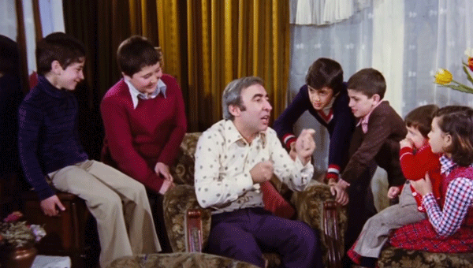

**v3.0** çünkü daha önceden çok fazla blog yazma girişimlerim oldu. Bu blogu'da onların bir devamı olarak görebiliriz. Çünkü yazmayı ve blog tutmayı küçüklükten beri seviyorum. Bu da benim online günlüğüm olsun.

> _"Merhaba Dünya v2.0"_ yazısını başka bir adreste yayınladığım tarih tam olarak **30 Haziran 2015**. 5 yıl aradan sonra v3.0 yazıyorum, değişik bir duygu.

Burada toplanma amacımıza gelelim. Gördüğünüz üzere yeni bir yerde yine birlikteyiz. İlk blogumu lise 2 ya da 3'e giderken yazıyordum. İlk yazılarım, yorumlarım ve okuyan bir kitlem o zaman olmuştu. Hatta ilk paramı o zamanlarda kazanmıştım. Burada tabii para kazanma gibi bir düşüncem yok. Tamamen düşüncelerimi, deneyimlerimi ve öğrendiğim şeyleri yazarak paylaşmayı planlıyorum.

Burada yazılacak olan genel kategoriler **yazılım** ve **kişisel** olacaktır. **Yazılım**, kategorisinde aslında fazka kod paylaşmayı seven biri değilim ama zaman zaman kod paylışımı olacak. Ama genel itibariyle yaşadığım bir sorun sonrası çözümünü ya kendim anlatacağım ya da özet geçerek hemen kaynak bir link belirteceğim. Zaten zamanla her şey daha da belli olacaktır. **Kişisel**, kategorisinde ise aklıma gelen herhangi bir konu, haftalık veyahut aylık raporlar ve bu tarz bir çok şeyler ile karşılacaksınız.

Bu siteyi **Gatsby** ile kodladım ve geliştirmeye devam ediyorum. O yüzden [github](https://github.com/berat) üzerinden henüz paylaşmadım. Paylaştığım zaman zaten duyursunu da yaparım. Fırsat buldukça blogu günceleştirip daha fonksiyonel, tasarımsal olarak güzel, içerik olarak ise dolu dolu olmasına özen göstereceğim.

Öyleyse yeni yazılarda görüşmek dileğiyle. Sağlıcakla kalın!
