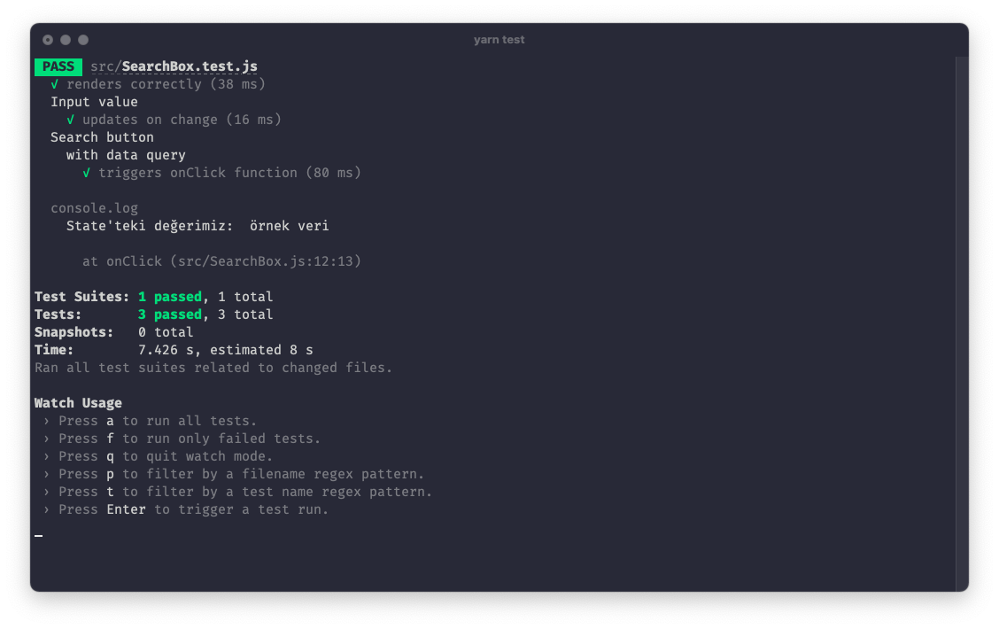

Ülkemizdeki şirketlerin bir çoğu --dersem yanılmam sanırım-- test yazma taraftarı değiller. Sanırım bunu bir zaman kaybı olarak görüyorlar. İlk zamanlarda ben de öyle görüyordum, belki şimdi de öyle görüyorum, bundan tam emin değilim. Her neyse, bugün sizlerle **react uygulamamıza nasıl test yazarız?** Hangi araçları kullanırız? Mantığı nedir? bunlardan bahsedeceğim. ~~Eğer ihtiyaç duyarsam belki bu yazının 2. partını da yazabilirim. Söz vermeyelim :)~~ Yazmıştım ama bu yazıda basit bir örnek yapalım. Bir sonraki yazıda biraz daha detaylı bir örnek yaparız.

Yandaki kelimelerin ne anlama geldiklerini ve ne amaçla kulanıldıklarına hakim olursanız bu yazı daha faydalı olacaktır. `Unit test`, `Jest`, `Enzyme`Teker teker ne işe yaradığını, nedir, ne değildir gibi tanımlar yapmayacağım. Bu şekilde tanımlardan bahsetmeyi de beceremiyorum. Bunun için bir kaç arama ile kolayca bilgi sahibi olabilirsiniz. (Bunun için yazının altına bir kaç kaynak bırakacağım.) Hadi örnek uygulamaya geçelim.

### Öncelikle bir senaryo düşünelim

- Bir adet input
- Bir adet buton

kullanalım. İnput'a yazılan metni bir state'e kaydedip butona tıkladığımız zaman state'teki değeri console.log ile ekrana verelim. Bunun için şöyle bir sayfamız olacak.

```js
import React, { useState } from "react"

export default function SearchBox(props) {
  const [text, setText] = useState("")

  const onChange = e => {
    setText(e.target.value)
  }

  const onClick = e => {
    console.log("State'teki değerimiz: ", text)
  }

  return (
    <div className="search-box">
      <input
        type="text"
        onChange={onChange}
        value={text}
        placeholder="Ara"
        className="search-input"
      />
      <button type="submit" className="button-click" onClick={onClick}>
        Tıkla
      </button>
    </div>
  )
}
```

Başlangıç seviyesinde olsanız da çok kolay bir şekilde anlayabileceğiniz bir bileşen. Yine de açıklamak gerekirse; input'a yazılan her yazı state'te tutuluyor ve butona tıkladığı zaman state'teki değer console.log ile yazılmaktadır. İlk aşama için belki bu örnek işimizi görecektir.

Bu şekilde bir bileşen oluşturduktan sonra şimdi sırada test yazmak var. Bu aşamada kodların hepsini vermek yerine kısım kısım verip üzerinden anlatayım. Belki bu şekilde daha iyi anlaşılır olur. Zaten ayrıca projeyi github üzerinden de paylaşacağım. Oradan daha detaylı bir şekilde inceleyebilirsiniz.

```javascript
import React from "react"
import { render, fireEvent } from "@testing-library/react"
import SearchBox from "./SearchBox"
```

Öncelikle gerekli olan kütüphaneleri dosyamıza dahil ediyoruz. `SearchBox` bileşene verdiğim isim.

<hr>

```javascript
it("renders correctly", () => {
  const { container, queryByPlaceholderText } = render(<SearchBox />)
  const button = container.getElementsByClassName("button-click").length

  expect(button).toBeTruthy()
  expect(queryByPlaceholderText("Search")).toBeTruthy()
})
```

Bileşendeki elemanlarımızın doğru bir şekilde yüklendiğini kontrol etmek için böyle bir kapsamımız var. Burada `render` fonksiyonu içinde `SearchBox` bileşenini gönderiyoruz ve buradan container ve queryByPlaceholderText'i çekiyoruz.

> **container :** Bileşen içindeki tüm elemanara ulaşmamızı sağlıyor. Bunu elemente class ismi ile ulaşmak istediğimden dolayı kullandım. Bunu kullanmadan elemente bir id değeri yazarak `queryAllByTestId` ile de ulaşabilirdim. <br > **queryByPlaceholderText :** Bileşen içinde input olduğu için bu input'a placeholder değeri ile ulaşıyorum.

Aslında bu kapsamda bileşen içindeki buton ve input elementlerini çağırıp render edilip edilmediğini kontrol ettim.

<hr>

```javascript
describe("Input value", () => {
  it("renders correctly", () => {})
}
```

Genel bir başlık altında test işlemi yapacaksak `describe` fonksiyonunu kullanabiliriz.

<hr>

Şimdi ise input'a yazı yazdırıp butona tıklama olayını test edelim. Bakalaım ekranda ne göreceğiz.

```javascript
it("triggers onClick function", () => {
  const requestClick = jest.fn()

  const { container, queryByPlaceholderText } = render(
    <SearchBox requestClick={requestClick} />
  )

  const searchInput = queryByPlaceholderText("Search")
  const button = container.querySelector(".button-click")

  fireEvent.change(searchInput, { target: { value: "örnek veri" } })
  fireEvent.click(button)
  expect(requestClick).not.toHaveBeenCalled()
})
```

`jest.fn()` işleminin tam işlevi nedir bilmiyorum ama internette sahte bir işlev olarak geçiyor.  
Yukarıda bahsettiğim gibi bileşen içerisindeki elemanlara ulaştık. Burada ekstra olarak bileşenimize props olarak `requestClick` gönderdik.

Daha önceden sayfada dahil ettiğimiz `fireEvent` fonksiyonu ile click ve change event'ini oluşturuyoruz. Burada ekstra olarak change event'ini oluştururken içine birkaç parametre gönderemliyiz. Bunlardan biri hangi input'un change event'ini kontrol ediyoruz. Bir diğerisi ise örnek bir veri gönderiyoruz. Buradaki mantık ise şudur; Normalde input'a yazdığımız yazıyı okumak için `onChange={e => console.log(e.target.value)}` şeklinde bir event'imiz olur. O yüzden test kapsamındaki veriyi de o şekilde göndermek gerekecek.

Daha sonra `expect` ile buton'a tıklatıp veriyi ekranımızda görüyoruz.



<hr>

Kaynak kodlarına [buradan](https://github.com/berat/hadi-test-yazalim) ulaşabilirsiniz. Ayrıca yazının bir sonraki serisinde bu repo üzerinden geliştirmeye devam edeceğimm.

### Kaynaklar

- [React Uygulamalarında TDD](https://oguzkilic.medium.com/react-uygulamalar%C4%B1nda-tdd-48f93335d8fb) ([@0guzKilic](https://mobile.twitter.com/0guzKilic))
- [“Test yazmaya zamanımız yok!”](https://medium.com/atolye15/test-yazmaya-zaman%C4%B1m%C4%B1z-yok-926993d92c47) ( [@alpcanaydin](https://mobile.twitter.com/alpcanaydin))
