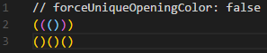
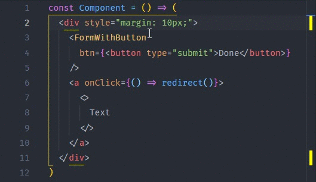
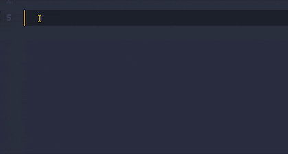
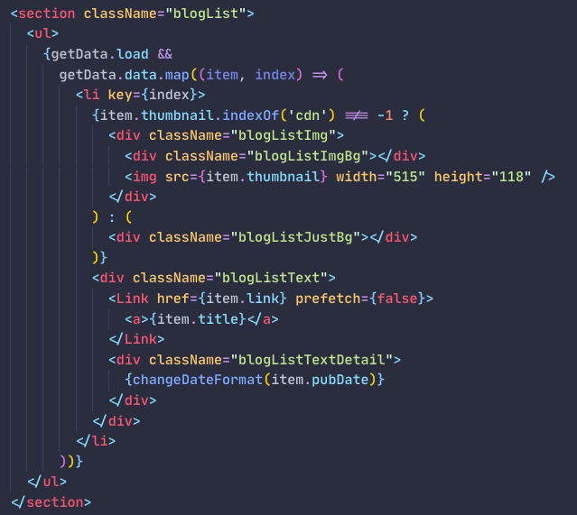
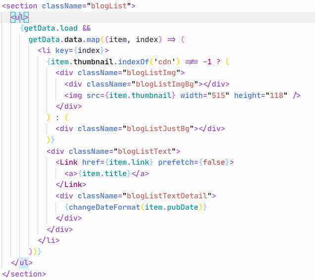
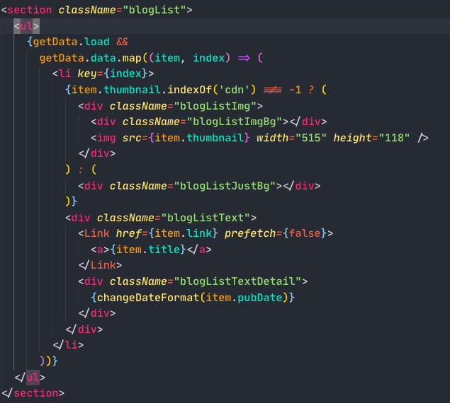

Selamlar, uzun zamandır bir şeyler yazmadığımı fark ettim. Bildiğiniz üzeri evleredeyiz ve eğitime uzaktan devam ediliyor. Bu kadar boş zamanımız varken kendimi eğitmeye ve proje geliştirmeye devam ediyorum. Bu zamanı verimli bir şekilde geçirmeye çalışıyorum. Bu zamanlarımın çoğu ise VSCode ekranına bakmak ile geçiyor. O yüzden burası benim dünyam sayılıyor ve dünyamı da güzelleştirmek için belli bir takım eklentiler, temalar ve ayarlar yapmak gerekiyor. Belki de bugün sizlerle aynı dünyayı paylaşacağız. Kim bilebilir :)

# Eklentiler

Önereceğim eklentiler dışında snippetler ve code runner için eklentiler kullanıyorum. Bunların zaten kullandığını varsayıyorum.

### 1- Backet Pair Colorizer | [İncele](https://marketplace.visualstudio.com/items?itemName=CoenraadS.bracket-pair-colorizer)

Eğer (süslü, köşeli) parantezler içerisinde boğuluyorsanız kurmanız gereken bir numaralı eklentidir. Her paranteze ait bir renk belirlenir ve hangi alan ile ilgileniyorsanız daha iyi odaklanabilirsiniz.

### 2- Colorize | [İncele](https://marketplace.visualstudio.com/items?itemName=kamikillerto.vscode-colorize)

<blockquote class="twitter-tweet">
VS Code&#39;da renk kodlarınızın &quot;colorize&quot; eklentisi ile bu şekilde görebilirsiniz. <a href="https://t.co/fHMFx0ty1I">pic.twitter.com/fHMFx0ty1I</a>
&mdash; Berat Bozkurt (@beratbozkurt0) <a href="https://twitter.com/beratbozkurt0/status/1249304972887539714?ref_src=twsrc%5Etfw">April 12, 2020</a></blockquote>
Twitter’da da paylaşmış olduğum bir eklenti. Tweet’de göreceğiniz gibi renk kodlarınızı bu şekilde renkli hale getirerek hangi renk olduğunu kolay bir şekilde görmenize imkan veren bir eklenti.

### 3- Highlight Matching Tag | [İncele](https://marketplace.visualstudio.com/items?itemName=vincaslt.highlight-matching-tag)

Eğer (süslü, köşeli) parantezler içerisinde boğuluyorsanız kurmanız gereken bir numaralı eklentidir. Her paranteze ait bir renk belirlenir ve hangi alan ile ilgileniyorsanız daha iyi odaklanabilirsiniz.

### 4- Markdown-formatter | [İncele](https://marketplace.visualstudio.com/items?itemName=mervin.markdown-formatter)

Size tavsiye ettiğim son eklenti ise markdown-formatter. Eğer .md uzantı dosyanıza içerik hazırlıyorsunuz bu eklenti ile işinizi hızlandırabilirsiniz.

# Temalar

Temalar için birden fazla tercihim var. Çünkü o anki mod halime göre o an farklı temalar kullanabiliyorum.

### 1- Palenight Theme | [İncele](https://marketplace.visualstudio.com/items?itemName=whizkydee.material-palenight-theme)

En fazla kullandığım temalardan biridir. Bu tonlarda kod yazarken odaklanabildiğim ve gözlerimi yormadığı için bu temayı çok fazla kullanıyorum.

### 2- Night Owl | [İncele](https://marketplace.visualstudio.com/items?itemName=sdras.night-owl)

Eğer erken saatlerde kod yazıyorsam açık renkli temalar kullanmaya özen gösteriyorum. Bir çok tema denedim ama bu temada karar kıldım.

### 3- Andromeda | [İncele](https://marketplace.visualstudio.com/items?itemName=EliverLara.andromeda)

Eğer biraz daha renkli bir tema arıyorsanız size bu temayı önerebilirim. Ama bir süre sonra göz yorgunluğuna neden olabilir. O yüzden kullanmayı fazla tercih etmiyorum.

**Font** olarak [JetBrains Mono](https://www.jetbrains.com/lp/mono/) kullanıyorum. Bu tarz fontları gerçekten çok seviyorum. Javascript kodu yazdığınız zaman `=>` bu şekilde görmek yerine birleşik görmek gerçekten güzel.
